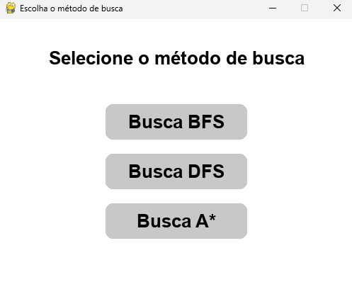
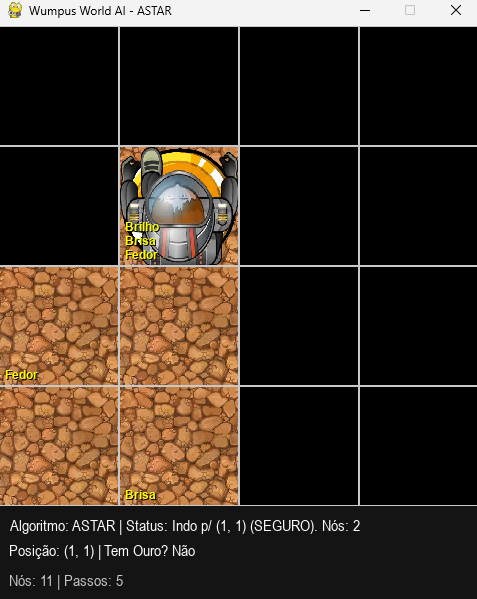
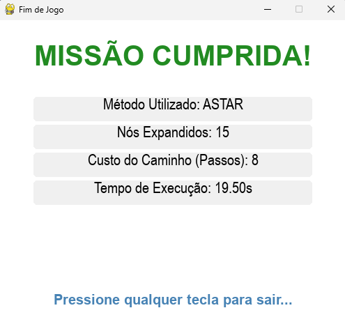

# Wumpus World

**Disciplina:** Introdução à Inteligência Artificial  
**Semestre:** 2025.2  
**Professor:** André Luis Fonseca Faustino  
**Turma:** T04

## Integrantes do Grupo
* Clóvis Luan Medeiros de Araújo (20240015041)
* Daniel Vítor de Oliveira Bezerra (20240005377)

## Descrição do Projeto
Este projeto implementa uma simulação interativa do clássico problema de Inteligência Artificial: o **Mundo do Wumpus**. O objetivo é desenvolver um Agente Inteligente capaz de explorar um ambiente parcialmente observável, inferir conhecimentos sobre perigos (Poços e Wumpus) baseados em percepções sensoriais (Brisa e Fedor) e traçar rotas seguras para encontrar o Ouro e retornar à saída.

O projeto foi desenvolvido em **Python** utilizando a biblioteca **Pygame** para a interface gráfica. O agente possui uma Base de Conhecimento (KB) dinâmica e permite ao usuário selecionar entre diferentes algoritmos de busca para a tomada de decisão:
* **BFS (Busca em Largura)**
* **DFS (Busca em Profundidade)**
* **A\* (A-Star Search)**

## Guia de Instalação e Execução

Siga os passos abaixo para rodar o projeto em sua máquina local.

### 1. Instalação das Dependências
Certifique-se de ter o **Python 3.8+** (recomendado 3.13) instalado. Clone o repositório e instale as bibliotecas listadas no `requirements.txt`:

```bash
# Clone o repositório
git clone https://github.com/danielvitorb/wumpus-world

# Entre na pasta do projeto
cd wumpus-world

# Instale as dependências
pip install -r requirements.txt
````

### 2. Como Executar

Execute o comando abaixo no terminal para iniciar o servidor local:

```bash
python main.py
```

## Estrutura dos Arquivos
    
  * `main.py`: Gerencia o fluxo entre Menu e Jogo.
  * `assets/`: Recursos multimídia.
    * `images/`: Sprites do jogo.
    * `audios/`: Efeitos sonoros e música.
  * `src/`: Código-fonte modularizado.
    * `agent/`: Inteligência do Agente (Cérebro `player.py` e Algoritmos `algorithms.py`).
    * `core/`: Modelo do Mundo (Regras `environment.py`).
    * `gui/`: Interface Gráfica (Renderização `interface.py`, Menus e Telas).
    * `utils/`: Configurações globais (`constants.py`)

## Resultados e Demonstração

### **1. Menu de seleção**


### **2. Simulação em execução**


### **3. Relatório final**


O sistema apresenta métricas em tempo real no HUD (Heads-Up Display) e um relatório final ao término da execução, contendo:
* **Tempo de execução:** Duração da partida em segundos.

* **Nós expandidos:** Custo computacional acumulado de todas as buscas realizadas (indica o esforço de replanejamento do agente).

* **Custo do caminho:** Número total de passos físicos dados pelo agente no tabuleiro.

## Referências

  * RUSSELL, Stuart; NORVIG, Peter. Artificial Intelligence: A Modern Approach. 3rd ed. Prentice Hall, 2009. (Capítulo 7: Logical Agents).
  * Documentação oficial do Pygame: https://www.pygame.org/docs/